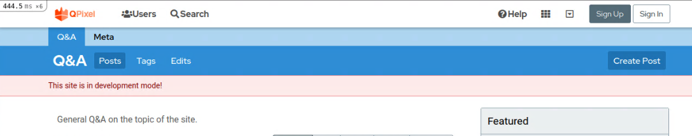
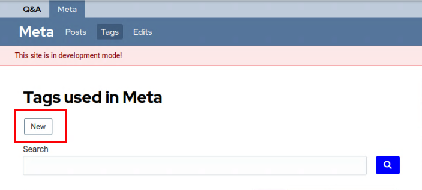
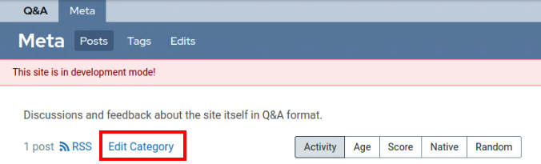
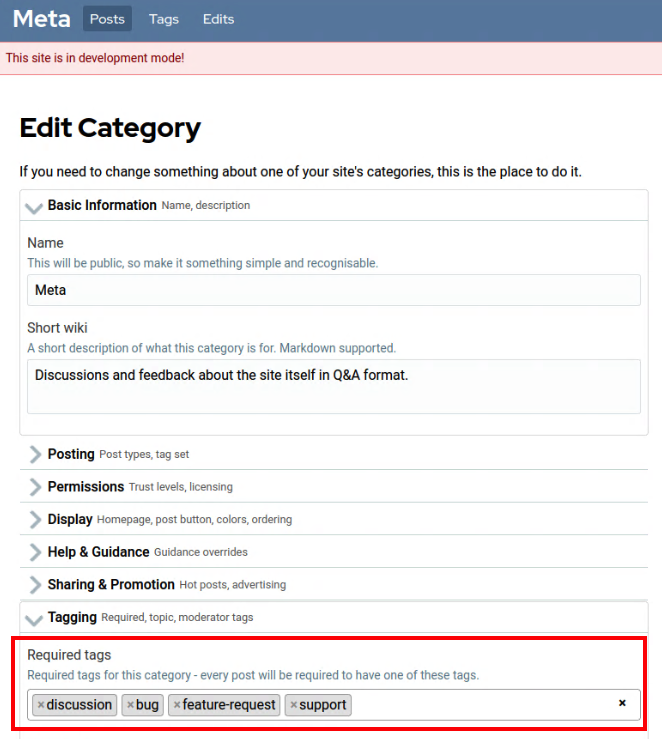

# QPixel Installation

These instructions are for setting up a development instance of QPixel. QPixel is
built with Ruby on Rails.

In that guide it is assumed that you already have a Unix environment available
with Ruby and Bundler installed. WSL works as well. Windows (core) has not been tested.

For an installation with **Docker** see the README.md in the [docker](docker) folder
for further instructions.

If you don't already have Ruby installed, use [RVM](https://rvm.io/) or
[rbenv](https://github.com/rbenv/rbenv#installation) to install it before following
these instructions.

QPixel is tested with Ruby 3.1 and 3.2. Note that Ruby 3.1 reaches end of life on 2025-03-31.

## Prerequisites

For Debian-Based Linux:

```
sudo apt update
sudo apt install gcc make pkg-config
sudo apt install autoconf bison build-essential libssl-dev libyaml-dev libreadline-dev zlib1g-dev libncurses5-dev libffi-dev libgdbm-dev
sudo apt install mysql-server libmysqlclient-dev
```

For Arch-Based Linux:

```
sudo pacman -Syyu
sudo pacman -Sy gcc
sudo pacman -Sy make
sudo pacman -Sy ruby autoconf bison base-devel unixodbc
sudo pacman -Sy openssl
sudo pacman -S mariadb mysqld nodejs
```

For Mac:

```
xcode-select --install
brew install mysql bison openssl mysql-client
bundle config --global build.mysql2 --with-opt-dir="$(brew --prefix openssl)"
```


## Environment

The following lists environment variables provided for QPixel customization
(this section is best-effort, please check for `ENV['<variable name>']`) in source code for the full list of available variables (for Docker-specific variables, see [Docker README](/docker/README.md)):

| Name                              | Value                                                  | Required? | Default                    | Description                                                                                                    |
| --------------------------------- | ------------------------------------------------------ | --------- | -------------------------- | -------------------------------------------------------------------------------------------------------------- |
| `BACKTRACE`                       | `<1>`                                                  | no        | -                          | Enables backtrace for libraries (see [backtrace_silencers.rb](/config/initializers/backtrace_silencers.rb))    |
| `BUNDLE_GEMFILE`                  |                                                        | no        |                            |                                                                                                                |
| `CONFIRMABLE_ALLOWED_ACCESS_DAYS` | `<number>`                                             | no        | `0`                        | Sets for how long (in days) an unconfirmed account can access the instance                                     |
| `DRIVER`                          | `<headless_chrome\|chrome\|headless_firefox\|firefox>` | no        | `headless_firefox`         | Sets browser to use when running system tests                                                                  |
| `MAILER_PROTOCOL`                 | `http\|https`                                          | no        | `https`                    | Sets default URL protocol to use with mailes (f.e., confirmation emails)                                       |
| `PIDFILE`                         | `<string>`                                             | no        | `tmp/pids/server.pid`      | Sets pidfile (a file where the id of a process is written to) for Puma                                         |
| `PORT`                            | `<number>`                                             | no        | `3000`                     | Sets the port on which the server will listen for incoming requests                                            |
| `RAILS_ENV`                       | `<development\|production\|test>`                      | no        | `development`              | Sets the environment to use (see [config/environments](/config/environments/))                                 |
| `RAILS_MAX_THREADS`               | `<number>`                                             | no        | `5`                        | Sets the maximum number of threads from the internal thread pool to use for requests                           |
| `RAILS_MIN_THREADS`               | `<number>`                                             | no        | `5`                        | Sets the minimum number of threads from the internal pool to use for requests                                  |
| `RAILS_SERVE_STATIC_FILES`        | `<boolean>`                                            | no        | -                          |                                                                                                                |
| `REDIS_URL`                       | `<string>`                                             | no        | `redis://localhost:6379/1` |                                                                                                                |
| `SECRET_KEY_BASE`                 | `<string>`                                             | yes       | -                          | Sets the secret key for signed cookie verification (can be generated with `rake secret`, used in `production`) |
| `SEEDS`                           | `<seeds source name>`                                  | no        | -                          | Runs only a specified set of seeds from [db/seeds](/db/seeds/)                                                 |
| `UPDATE_POSTS`                    | `<boolean>`                                            | no        | -                          | If set to `true`, updates seeded posts when running post seeds                                                 |
| `WEB_CONCURRENCY`                 | `<number>`                                             | no        | `2`                        |                                                                                                                |

### Install JS runtime

If you already have Node.JS installed, you can skip this step. If not,
[download and install it](https://nodejs.org/en/download/) or for example
`sudo apt install nodejs`.

On Mac with homebrew, `brew install node` .

### Install Redis

If you haven't already got it, [download and install Redis](https://redis.io/download)
or for example `sudo apt install redis-server`.

For mac with homebrew, `brew install redis` .

### Install Imagemagick

If you haven't already installed Imagemagick, you'll need to
[install it for your system](https://imagemagick.org/script/download.php).

If you install Imagemagick from APT on a Debian-based system, you may need to
also install the `libmagickwand-dev` package.

`sudo apt install libmagick++-dev` should also work.

For Mac with homebrew, `brew install imagemagick` .

### Install Libvips

If you haven't already installed Libvips, you'll need to [install it for
your system](https://www.libvips.org/).

To install libvips from APT on a Debian-based system, use
`sudo apt install libvips`

For Mac with homebrew, `brew install vips` .

## Install QPixel

Clone the repository and `cd` into the directory:

    git clone https://github.com/codidact/qpixel
    cd qpixel

After downloading QPixel, you need to install all the dependencies. For that, you need to run

    bundle install

If Ruby complains, that the Bundler hasn't been installed yet, use `gem install bundler` and
then re-run the above command.

### Set up the Database

If you weren't asked to set the root MySQL user password during `mysql-server` installation,
the installation is likely to be using Unix authentication instead. You'll need to sign into
the MySQL server with `sudo mysql -u root` and create a new database user for QPixel:

```sql
CREATE USER qpixel@localhost IDENTIFIED BY 'choose_a_password_here';
GRANT ALL ON qpixel_dev.* TO qpixel@localhost;
GRANT ALL ON qpixel_test.* TO qpixel@localhost;
GRANT ALL ON qpixel.* TO qpixel@localhost;
```

Copy `config/database.sample.yml` to `config/database.yml` and fill in the correct host,
username, and password for your environment. If you've followed these instructions (i.e. you
have installed MySQL locally), the correct host is `localhost` or `127.0.0.1`.

You will need to set the Redis connection details there too. If you've followed these instructions,
the sample file should already contain the correct values for you, but if you've customised your
setup you'll need to correct them.

You'll also need to copy the Active Storage configuration from `config/storage.sample.yml` to `config/storage.yml`.

If you are using MariaDB instead of MySQL, you will need to replace all occurrences of
`utf8mb4_0900_ai_ci` with `utf8mb4_unicode_ci` in `db/schema.rb`.

Set up the database:

    rails db:create
    rails db:schema:load
    rails r db/scripts/create_tags_path_view.rb
    rails db:migrate

We also recommend you load the QPixel console extensions for easier development:

    cp .sample.irbrc .irbrc

You'll need to create a Community record and purge the Rails cache before you can seed the database.
In a Rails console (`rails c`), run:

```ruby
Community.create(name: 'Dev Community', host: 'localhost:3000')
Rails.cache.clear
```

After that you can run `rails db:seed` to fill the database with necessary seed data, such as settings, help posts and default templates. (If you are preparing a production deployment, you might choose to edit some of the help seeds first. The "policy" topics are not included in the initial seed. See "Help Topics" at the end of this guide.)

    $ rails db:seed
    Category: Created 2, skipped 0
    [...]

Now comes the big moment: You can start the QPixel server for the first time. Run:

    rails s

Open a web browser and visit your server, which should be running under [http://localhost:3000](http://localhost:3000).




### Create administrator account

You can create the first user account in the application through the "Sign up" route.
To upgrade the user account to an admin account, run `rails c` for a console, followed by:

```ruby
User.last.update(confirmed_at: DateTime.now, is_global_admin: true)
```

If you create more accounts, you can visit `http://localhost:3000/letter_opener` to access the
confirmation email and then promote your user to admin with
`rails r "User.last.update(is_global_admin: true)"`.

Reload the web browser and you should see the elevated access.

### New site setup

While being logged into your administrator account, go to [http://localhost:3000/admin/setup](http://localhost:3000/admin/setup).
Review the settings (if you want; you can change them later) and click "Save and continue" to complete
setting up the dev server.

## Create a Post

You can now create your first post. There are character requirements for the
body and title, and you are required to add at least one tag.


When you've met the length requirements and added a tag, the "Save Post in Q&A" button is enabled and you can click it.


## Optional: Single Sign On

Please see our wiki for [detailed instructions](https://github.com/codidact/qpixel/wiki/Setting-up-SAML-Single-Sign-On) on setting up SAML Single Sign-On.


## Optional: Required Tags

The special Meta tags (discussion, bug, support, feature-request) are not seeded. (We do not assume that all deployments want to manage user feedback the same way.) You can create tags directly on the Meta Tags page:



Next, edit the Meta category settings:



Add the tags to the "Required tags" section:



## Optional: Email blocklists

If you want to block some known-bad actors from using the deployment, you can setup the following email blocklists:

- Bad email patterns for granular control over which email addresses to block.
  To enable it, add a file named `qpixel-email-patterns.txt` to the deployment root's parent directory.
  Each line in the file should be a valid regular expression that a given email will be checked against.
- Bad email domains for bulk blocks on emails from known bad domains.
  To enable it, add a file named `qpixel-domain-blocklist.txt` to the deployment root's parent directory.
  Each line in the file corresponds to a domain that should be blocked.

## Optional: Help Topics

If you are running a development server, you might not care a lot about what's in the help. If you are planning to deploy a server for actual use, however, note that the seeds have some placeholder text you'll want to edit. We have provided starting points (to be edited) for the following topics:

- Terms of service (TOS)
- Code of conduct (COC)
- Privacy policy
- Spam policy
- Global (network) FAQ

The corresponding posts in db/seeds/posts have some places marked with "$EDIT" where you will probably want to insert URLs, email addresses, and the like. We recommend reviewing all of the content in these topics. There are two ways to edit these topics: in the source files before adding to your database, or through the UI in your running instance.

If you edit the seed files, use the following command to add them to your database:

`UPDATE_POSTS=true rails db:seed`

You can also edit the topics in the UI. As an administrator, you'll see an edit button on help topics when you view them, and the editor provides an option to deploy changes across your network of communities. Administrators can update help topics in this way at any time.
