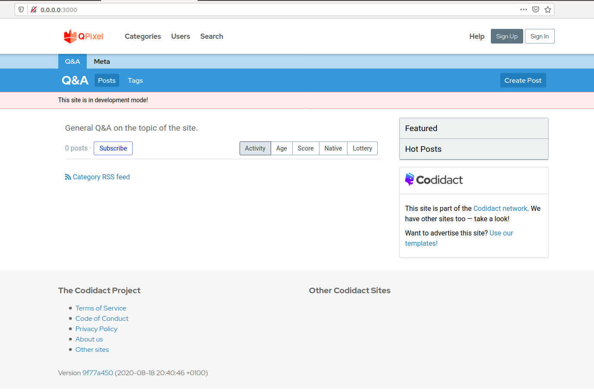

# QPixel [](https://circleci.com/gh/codidact/qpixel) [](https://coveralls.io/github/ArtOfCode-/qpixel?branch=master)
Rails-based version of our core software. Currently under active development towards MVP.

## Installation
These instructions are assuming you already have a Unix environment available with Ruby and Bundler installed. WSL should work as well,
but Windows is unlikely to.

If you don't already have Ruby installed, use [RVM](https://rvm.io/) or [rbenv](https://github.com/rbenv/rbenv#installation) to install
it before following these instructions.

### Install prerequisites

For Linux:

```
sudo apt update
sudo apt install gcc
sudo apt install make
sudo apt install libmysqlclient-dev
sudo apt install autoconf bison build-essential libssl-dev libyaml-dev libreadline-dev zlib1g-dev libncurses5-dev libffi-dev libgdbm-dev
sudo apt install mysql-server
```

For Mac:

```
xcode-select --install
brew install mysql bison openssl mysql-client
bundle config --global build.mysql2 --with-opt-dir="$(brew --prefix openssl)"
```

### Install JS runtime
If you already have Node.JS installed, you can skip this step. If not, [download and install it](https://nodejs.org/en/download/).

### Install Redis
If you haven't already got it, [download and install Redis](https://redis.io/download).

### Install Imagemagick
If you haven't already installed Imagemagick, you'll need to [install it for your system](https://imagemagick.org/script/download.php)
    
### Download QPixel
Clone the repository and `cd` into the directory:

    git clone https://github.com/codidact/qpixel
    cd qpixel

### Configure database connection
If you weren't asked to set the root MySQL user password during `mysql-server` installation, the installation is likely to be using
Unix authentication instead. You'll need to sign into the MySQL server with `sudo mysql -u root` and create a new database user for QPixel:

```sql
CREATE USER qpixel@localhost IDENTIFIED BY 'choose_a_password_here';
GRANT ALL ON qpixel_dev.* TO qpixel@localhost;
GRANT ALL ON qpixel_test.* TO qpixel@localhost;
GRANT ALL ON qpixel.* TO qpixel@localhost;
```

Copy `config/database.sample.yml` to `config/database.yml` and fill in the correct host, username, and password for your environment.
If you've followed these instructions (i.e. you have installed MySQL locally), the correct host is `localhost` or `127.0.0.1`.

You'll also need to fill in details for the Redis connection. If you've followed these instructions, the sample file should already
contain the correct values for you, but if you've customised your setup you'll need to correct them.

### Set up QPixel
Install gems:

    bundle install
    
Set up the database:

    rails db:create
    rails db:schema:load
    rails r db/scripts/create_tags_path_view.rb
    rails db:migrate
    rails db:seed

Run the server!

    rails s
    
You'll need to create a Community record before the server will display any content. In a console, run:

```ruby
Community.create(name: 'Dev Community', host: 'localhost:3000')
```

You can create the first user account in the application, which should be running at http://localhost:3000/. To upgrade the user account
to an admin account, run `rails c` for a console, followed by:

```ruby
User.last.update(confirmed_at: DateTime.now, is_global_admin: true)
```

## Install with Docker

A [docker-compose.yml](docker-compose.yml) file is provided for deployment with Docker compose, if you choose.

### 1. Build Containers

You should first build the images, before making any changes to config files. We do this so the container
is not built with secrets.

```bash
docker-compose build
```


### 2. Secrets

Your secrets (the mysql database credentials and admin user name) are stored
in [docker/dummy.env](docker/dummy.env). You should copy the file to an env file you
won't add to version control:

```bash
cp docker/dummy.env docker/env
```

And then update them to what you like!

```
COMMUNITY_ADMIN_USERNAME=admin
COMMUNITY_ADMIN_PASSWORD=admin
COMMUNITY_ADMIN_EMAIL=admin@domain.com
```

If you aren't using the dummy environment file, make sure to change the path in your
docker-compose.yml - there are two specifications of `env_file` to change.


```yaml
env_file:
  - ./docker/dummy.env
```
to
```yaml
env_file:
  - ./docker/env
```

You'll also need to put the correct username and password in [docker/mysql-init.sql](docker/mysql-init.sql).
Make sure to not update this file in version control.

### 3. Database File
Then, copy the docker compose database file to be found as the default database configuration:

```bash
$ cp config/database.docker.yml config/database.yml
```

You should change the username and password to be the ones you defined in your [docker/dummy.env](docker/dummy.env) (or the file
that you created).
**DO NOT UPDATE THIS FILE AND THEN PUSH TO VERSION CONTROL**.

```
...
  username: qpixel
  password: qpixel
```

In the docker-compose.yml, you should specify your community name, change the environment variable `COMMUNITY_NAME` in your docker-compose.yml

```
  uwsgi:
    restart: always
    build: 
      context: "."
      dockerfile: docker/Dockerfile
    environment:
      - COMMUNITY_NAME=Dinosaur Community
      - RAILS_ENV=development
```

### 4. Start Containers

Then start your containers! 

```bash
docker-compose up -d
Creating qpixel_redis_1 ... done
Creating qpixel_db_1    ... done
Creating qpixel_uwsgi_1 ... done
```

Check to make sure the server is running (and verify port 3000, note that you can change this mapping
in the docker-compose.yml.

```
uwsgi_1  | => Booting Puma
uwsgi_1  | => Rails 5.2.4.3 application starting in development 
uwsgi_1  | => Run `rails server -h` for more startup options
uwsgi_1  | Puma starting in single mode...
uwsgi_1  | * Version 3.12.6 (ruby 2.6.5-p114), codename: Llamas in Pajamas
uwsgi_1  | * Min threads: 0, max threads: 16
uwsgi_1  | * Environment: development
uwsgi_1  | * Listening on tcp://localhost:3000
uwsgi_1  | Use Ctrl-C to stop
```

You should then be able to open your browser to [http://0.0.0.0:3000](http://0.0.0.0:3000)
and see the interface. 



You can login with what you defined for `$COMMUNITY_ADMIN_USERNAME`,
`$COMMUNITY_ADMIN_EMAIL` and `$COMMUNITY_ADMIN_PASSWORD`

**under development**

### 4. Stop Containers

When you are finished, don't forget to clean up.

```bash
docker-compose stop
```

## License
[AGPL licensed](https://github.com/codidact/qpixel/blob/master/LICENSE)

## Contributing
Contributions are welcome - please read the [CONTRIBUTING](https://github.com/codidact/qpixel/blob/develop/CONTRIBUTING.md) document
before you start and look at the [TODO list](https://github.com/codidact/qpixel/wiki/TODO-list) for things to do.
