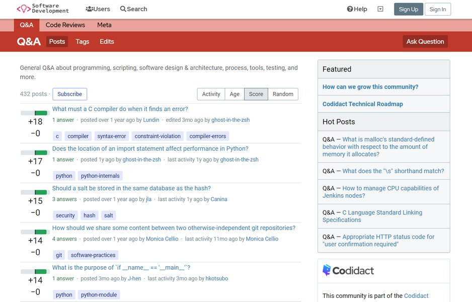

   
  <h1>QPixel</h1>
  <strong>Q&A by the community, for the community</strong>

 

  
  
  

Rails-based version of our core software, powering [codidact.com](https://codidact.com). Currently under active development towards MVP.

## Table of Contents
- [Features](#features)
- [Community](#community)
- [Contributing](#contributing)
- [Installation](#installation)
- [License](#license)

## Features

### 6. Set up QPixel
Install gems:
=======
## Features
>>>>>>> moved installation instructions to separate file, added screenshot to readme

- Supports multiple communities within a single installation
- Allows multiple categories within each community
- And multiple post types (Q&A, Articles, ...) within each category
- Voting on content and sorting based on a [modified score](https://meta.codidact.com/help/scoring)
  that accounts for controversy
- Abilities/privileges based on [activity](https://meta.codidact.com/help/abilities)
- Content written in Markdown with live preview
- Support for MathJax, image uploads, custom content licenses
- High degree of [customization](https://meta.codidact.com/posts/280722/280723#answer-280723) possible
- Open source

## Community

To discuss features and voice ideas, please ask a new question on [Codidact Meta](https://meta.codidact.com).
For technical discussions about the QPixel software itself, please ask on
[Codidact Collab](https://collab.codidact.org) instead.

## Contributing

Contributions are welcome - please read the [CONTRIBUTING](CONTRIBUTING.md) document before you
start and look at the [GitHub issues](https://github.com/codidact/qpixel/issues) for things to do.

## Installation

For a complete installation see the [Installation guide](INSTALLATION.md).

## License

QPixel is [AGPL licensed](LICENSE).

 

[⬆ Back to Top](#table-of-contents)
