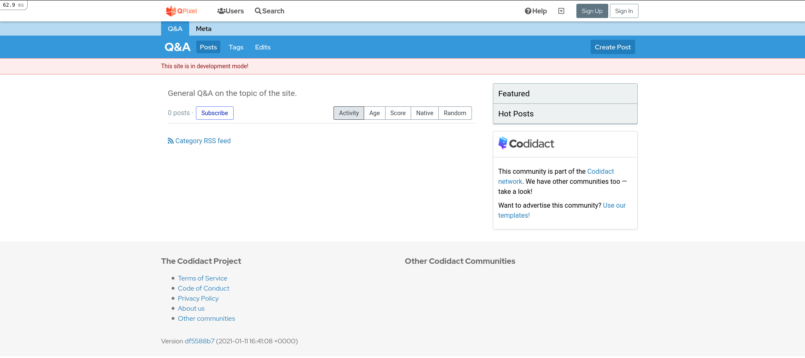
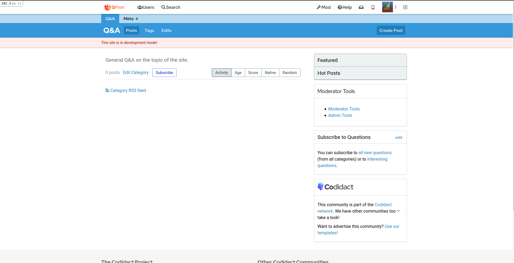
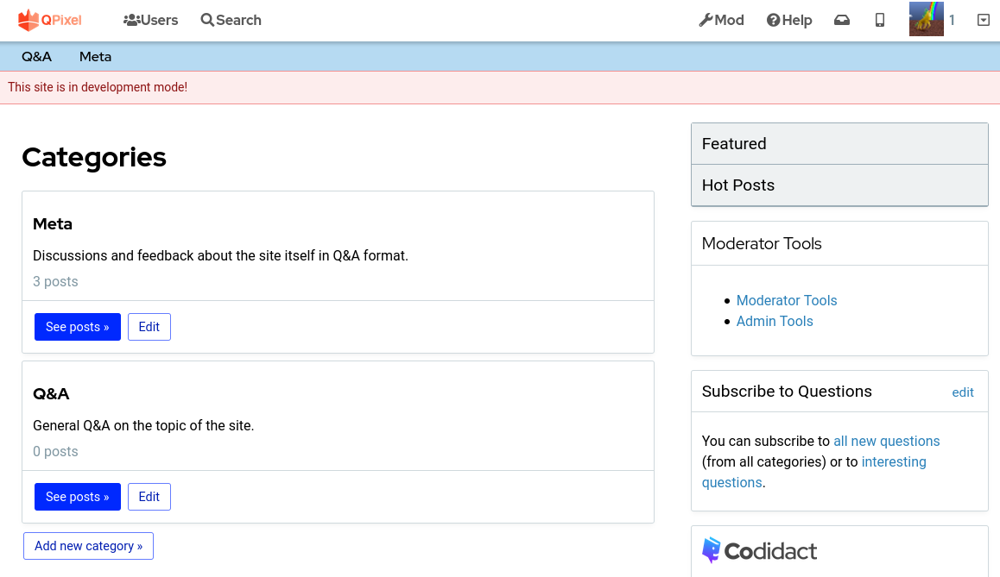
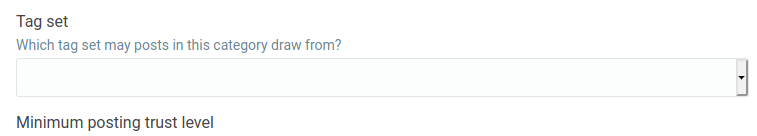
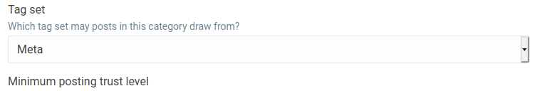
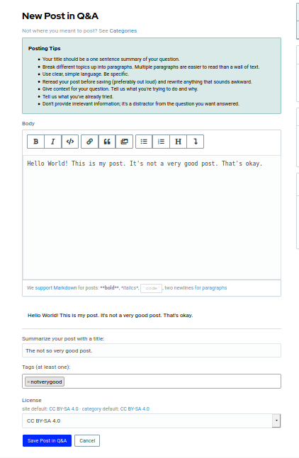

# Docker Installation

A [docker-compose.yml](../docker-compose.yml) file is provided for deployment with Docker compose, if you choose.

## 1. Build Containers

You should first build the images, before making any changes to config files. We do this so the container
is not built with secrets.

```bash
docker-compose build
```

If you need to just rebuild one container, you can do that too.

```bash
docker-compose build uwsgi
docker-compose build db
docker-compose build redis
```

## 2. Setup and Secrets

The `docker-compose.yml` file uses a `.env` file in the same directory to load dynamic values used when the docker containers are initialized.

This is useful for setting up custom values locally. Additionally, your secrets (the mysql database credentials and admin user name) are inserted into the running container through the `docker/env` file.

Both the `.env` file and the `docker/env` file are gitignored, so you can change values to suit, these filed need to be copied to the correct locations with some default values. You can do this in one step by executing a bash script.

```bash
# ensure script is executable, from the project root:
chmod +x docker/local-setup.sh
docker/local-setup.sh
```

Editing the `./.env` file will modify the corresponding variables used in the docker-compose.yml file but **NOT** the environment variables in the container. Editing the `./docker/env` file will change environment variables only in the running container.

## 3. Database File
Ensure `config/database.yml` has the username and password as defined in [docker/env](dummy.env) file. The `config/database.yml` should already be gitignored.

The `COMMUNITY_NAME` value defined in the `.env` file defines the initial community name on your local DB.

the `COMMUNITY_ADMIN_USERNAME`, `COMMUNITY_ADMIN_PASSWORD` and `COMMUNITY_ADMIN_EMAIL` values in the `docker/env` file define the first user you can log in as - however you will need to follow the instructions below to ensure you can log in as that user.

## 4. Start Containers

Then start your containers! 

```bash
docker-compose up # append -d if you want to detach the processes, although it can be useful to see output into the terminal
Creating qpixel_redis_1 ... done
Creating qpixel_db_1    ... done
Creating qpixel_uwsgi_1 ... done
```

The uwsgi container has a sleep command for 15 seconds to give the database a chance to start,
so don't expect to see output right away. After about 20 seconds, check to make sure the server is running (and verify port 3000, note that you can change this mapping in the `.env` file)

```
uwsgi_1  | => Booting Puma
uwsgi_1  | => Rails 5.2.4.3 application starting in development 
uwsgi_1  | => Run `rails server -h` for more startup options
uwsgi_1  | Puma starting in single mode...
uwsgi_1  | * Version 3.12.6 (ruby 2.6.5-p114), codename: Llamas in Pajamas
uwsgi_1  | * Min threads: 0, max threads: 16
uwsgi_1  | * Environment: development
uwsgi_1  | * Listening on tcp://localhost:3000
uwsgi_1  | Use Ctrl-C to stop
```

You should then be able to open your browser to [http://localhost:3000](http://localhost:3000)
and see the interface. 



Before you login, since we don't have email configured, you'll need to set a manual
`confirmed_at` variable for your newly created user. You can do this easily with a single
command to the container:

```bash
$ docker exec qpixel_uwsgi_1 rails runner "User.second.update(confirmed_at: DateTime.now)"
Running via Spring preloader in process 111
```

The first user is the system user, so the second user is the admin created during the
start of the container. And you can of course do this same command for any future users that you don't want to require email confirmation for. You can then click "Sign in" to login with what you defined for `$COMMUNITY_ADMIN_EMAIL` and `$COMMUNITY_ADMIN_PASSWORD`. Importantly, your password must be 6 characters or greater, otherwise the user won't be created. 

## 5. Login

Once you are logged in, you should see your icon in the top right:



## 6. Configure Categories

Before you try to create a post we need to configure categories! 
Go to `http://localhost:3000/categories/`



 Click "edit" for each category and scroll down to see the "Tag Set" field. This
 will be empty on first setup.



You will need to select a tag set for each category! For example, the Meta category can be
associated with the "Meta" tag set, and the Q&A category can be associated with "Main"



Make sure to click save for each one.

## 7. Create a Post

You should then be able to create a post! There are character requirements for the
body and title, and you are required at least one tag.



And then click to "Save Post in Q&A"


That's it!

### 8. Stop Containers

When you are finished, don't forget to clean up.

```bash
docker-compose stop
docker-compose rm
```

### 9. Next steps

The current goal of this container is to provide a development environment for
working on QPixel. This deployment has not been tested with email notifications
enabled / set up, nor to deploy in production mode. If you require these 
modifications, please [open an issue](https://github.com/codidact/qpixel/issues).
